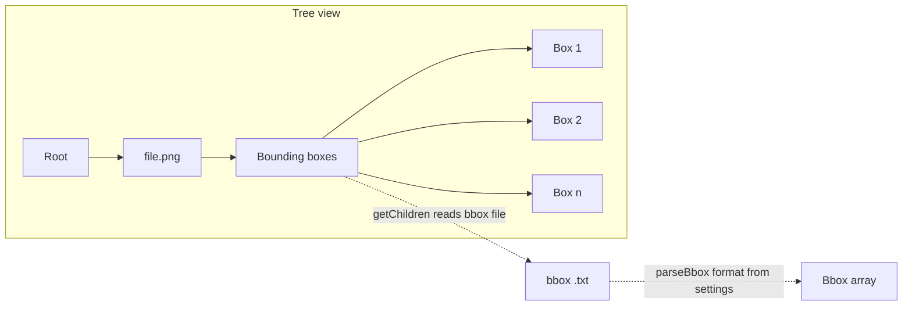

# Bounding box tree and drag-to-edit

## Current state

- **Left panel** ([src/explorer.ts](src/explorer.ts)): `ProjectTreeDataProvider` returns a flat list of `ProjectTreeItem` (one per image). Each item has `CollapsibleState.None` and no children; there is no bounding-box list under images.
- **Editor** ([src/editorProvider.ts](src/editorProvider.ts)): Custom editor shows image + SVG overlay with rectangles. Boxes are drawn but there is no resize or move logic—only double-click to delete and save. No selected box or handles.

## 1. Hierarchical tree in the extension panel

**Goal:** Show under each image a "Bounding boxes" node whose children are "box 1", "box 2", … "box n".

**Approach:**

- Introduce a **union of tree element types** so the provider can return different node kinds:
  - **Image node** (current `ProjectTreeItem`): represents the image file; must be **collapsible** (e.g. `CollapsibleState.Collapsed`) so it can be expanded.
  - **Bounding boxes group node**: single child of an image; label "Bounding boxes", collapsible, expandable.
  - **Box node**: one per bounding box; label "Box 1", "Box 2", … or use `bbox.label` when available (e.g. COCO/Pascal).

**Data flow:**

**Implementation:**

- **New types in [src/explorer.ts](src/explorer.ts):**
  - `BoundingBoxesGroupItem` (extends `TreeItem`): holds `imageUri`, `bboxUri`, `workspaceFolder`; `collapsibleState = Collapsed`; no command (expand only).
  - `BoxTreeItem` (extends `TreeItem`): holds `imageUri`, `bboxIndex` (0-based), optional `label`; `contextValue = 'bboxItem'`; **command**: open the image with the custom editor and pass the selected box index (see below).
- **Refactor `ProjectTreeItem`:** keep it for the image row only; set `collapsibleState = vscode.TreeItemCollapsibleState.Collapsed` when the item has a bbox file (or always collapsed so "Bounding boxes" appears for all images).
- `**getChildren(element)`:**
  - `element === undefined` → same as today: list of `ProjectTreeItem` (images), but with `CollapsibleState.Collapsed` for expandable images.
  - `element instanceof ProjectTreeItem` → return `[new BoundingBoxesGroupItem(...)]` (one child).
  - `element instanceof BoundingBoxesGroupItem` → **async**: read bbox file with `vscode.workspace.fs.readFile(bboxUri)`, decode, then `parseBbox(content, getSettings().bboxFormat, imgW, imgH)`. For **YOLO** we need image dimensions: options are (a) add a small dependency (e.g. `image-size`) to read image dimensions from the file, or (b) for YOLO only show "Box 1", "Box 2" from line count and omit labels (no parse until editor opens). Recommend (b) to avoid new deps; document in README if needed.
  - Return one `BoxTreeItem` per box (label "Box &lt;index+1&gt;" or `b.label` when set).
- **TreeDataProvider typing:** the provider's generic should be the union type (e.g. `ProjectTreeItem | BoundingBoxesGroupItem | BoxTreeItem`) so `getTreeItem` and `getChildren` are type-safe.

**Opening the editor with a box selected:**

- When the user clicks a **box** in the tree, we must open the image in the custom editor and tell the webview which box index is selected (so it can highlight it and show resize handles).
- **Mechanism:** use `context.workspaceState` (or the extension's global state) keyed by image URI: e.g. `selectedBoxIndex_${imageUri.toString()} = index`. The box item's **command** will: (1) set that state, (2) run `vscode.commands.executeCommand('vscode.openWith', imageUri, 'boundingBoxEditor.imageEditor')`.
- **Editor provider** ([src/editorProvider.ts](src/editorProvider.ts)): in `resolveCustomEditor`, after building the webview, read `context.workspaceState.get('selectedBoxIndex_...')` for the document URI; if present, pass `selectedBoxIndex` into the webview (e.g. in the initial HTML or via `postMessage` right after `updateWebview()`), then **clear** that key so the next open does not reuse it.
- **Webview:** when it receives `selectedBoxIndex` (or when the user clicks a rect), set a "selected box index" and redraw so that box is highlighted and has resize handles (see below).

**Package.json:** register a command for "open image editor with selected box" and use it from `BoxTreeItem.command`. Ensure the new command is in `contributes.commands` and that the box item uses it with `arguments: [imageUri, bboxIndex]`.

---

## 2. Drag borders on the image to edit

**Goal:** When a box is selected (by tree click or by clicking on the canvas), the user can drag **edges or corners** to resize it, and optionally drag the **body** to move it.

**Approach:**

- **Selection:** Maintain `selectedBoxIndex` in the webview (from initial message or from click on a rect). Only one box selected at a time.
- **Handles:** When `selectedBoxIndex !== undefined`, draw the selected rect with a distinct style (e.g. thicker stroke) and draw 8 resize handles (n, s, e, w, ne, nw, se, sw)—either as small circles/rects overlaid on the SVG, or as invisible hit areas. Alternatively, no visible handles: on **mousedown** on or near a rect, hit-test whether the click is near an edge/corner (within a few px) or on the body; set "drag mode" to resize (with which handle) or move.
- **Drag:**
  - **mousedown:** record `startX`, `startY`, `boxIndex`, `handle` (e.g. `'n'|'s'|'e'|'w'|'ne'|'nw'|'se'|'sw'|'body'`).
  - **mousemove:** compute delta in **image coordinates** (divide by `scaleX`/`scaleY`). Update `boxes[boxIndex]`: for resize, adjust `x_min`, `y_min`, `width`, `height` according to which handle is dragged; for move, add delta to `x_min`/`y_min`. Clamp so width/height stay non-negative.
  - **mouseup:** stop drag, call `vscode.postMessage({ type: 'save', boxes })`.
- **Coordinate transform:** Event coordinates (e.g. `offsetX`/`offsetY` relative to the SVG, or getBoundingClientRect-based) must be converted to image coords: `imgX = (displayX / scaleX)`, `imgY = (displayY / scaleY)`, then update the `Bbox` in pixel space; on save, the host already serializes with `document.imgWidth`/`imgHeight`.
- **Cursor:** Set cursor per handle (n/s → ns-resize, e/w → ew-resize, corners → nesw-resize/nwse-resize, body → move). Use CSS or `element.style.cursor` during drag.
- **Event listeners:** Attach `mousedown` to the SVG (or to each rect/handle); `mousemove` and `mouseup` on `window` or `document` so drag continues if the pointer leaves the rect.

**Files to change:** [src/editorProvider.ts](src/editorProvider.ts) — all logic is in the inline script inside `getWebviewHtml()`. Extend the script to: (1) accept optional `selectedBoxIndex` from the host and set selection; (2) draw handles for the selected box; (3) implement mousedown/mousemove/mouseup with hit-test and resize/move math; (4) postMessage save on mouseup after an edit.

**Edge cases:** Prevent negative width/height when resizing (e.g. flipping min/max when the user drags past the opposite edge). Keep coordinates within image bounds if desired (optional).

---

## 3. Tests and docs

- **Explorer:** Add unit tests (e.g. in `src/test/explorer.test.ts`) for the tree provider: `getChildren(undefined)` returns image items; `getChildren(imageItem)` returns one group item; `getChildren(groupItem)` returns box items (mock `workspace.fs.readFile`, `findFiles`, and `getSettings` so we do not touch the real FS). Cover COCO (and optionally Pascal) so parsed labels appear; YOLO can be "Box 1"…"Box n" from line count if we skip full parse in tree.
- **Editor:** No strict need for new unit tests for the webview drag logic (hard to test in Node). If we add `workspaceState` for `selectedBoxIndex`, we could add a small test that the provider reads and clears it when present (optional).
- **README:** If we document "Bounding boxes in tree" or "YOLO in tree shows generic Box n without labels", add a short note. Any quirk or workaround as per project rules.

---

## 4. Summary of file changes

- **[src/explorer.ts](src/explorer.ts):** Add `BoundingBoxesGroupItem`, `BoxTreeItem`; make image items collapsible; implement `getChildren` for group (read + parse bbox file) and for box list; box item command opens editor with selected index.
- **[src/extension.ts](src/extension.ts):** Pass `context` or ensure editor has access to `workspaceState`; register command for "open image with box index" if not inline in tree.
- **[src/editorProvider.ts](src/editorProvider.ts):** Resolve `selectedBoxIndex` from `workspaceState` by document URI and pass to webview; extend webview HTML/script: selection state, resize handles or border hit-test, mousedown/mousemove/mouseup for resize and move, coordinate transform, save on mouseup.
- **[package.json](package.json):** Add command contribution for opening the image editor with a selected box index (if exposed as a command).
- **New: `src/test/explorer.test.ts`:** Unit tests for tree provider `getChildren` (root, image, group).
- **[README.md](README.md):** Optional: note that tree shows "Box 1"…"Box n" and that YOLO labels in tree may be generic until the editor is opened.

---

## 5. Dependency note

- **YOLO in tree:** Parsing YOLO needs image dimensions. To avoid adding a dependency, the plan recommends **not** parsing YOLO in the tree: when format is YOLO, derive box count from line count and show "Box 1", "Box 2", …; full parse (with dimensions) happens when the user opens the image in the editor. If you prefer accurate YOLO labels in the tree, we can add a lightweight package (e.g. `image-size`) to read image dimensions in the extension and then call `parseBbox(..., 'yolo', w, h)` when building box children.

