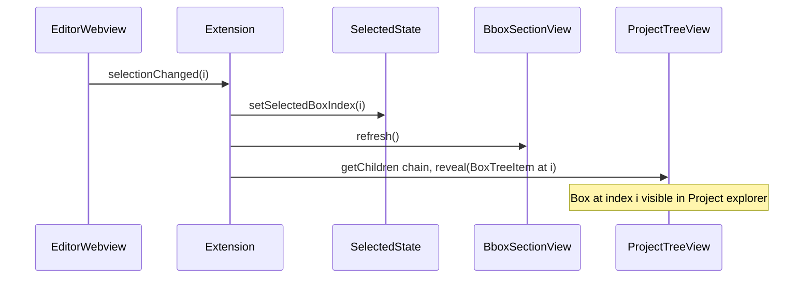

# Context menus, rename, delete, selection sync, and x/y/w/h display

## Scope (7 items)

1. **Right-click context menu on extension explorer** (Project view): image row → "Add a new box", "Remove all boxes"; box row → "Remove box", "Rename box".
2. **Rename box** in Bounding Boxes section and in editor (command that prompts for name, updates bbox file).
3. **Editor: Delete/Backspace** removes the selected box (webview keydown).
4. **Show x, y, h, w** next to each box label in Project view and in Bounding Boxes section.
5. **Selection sync**: selecting a box in Project view shows it as selected in Bounding Boxes section; editor selection changes update Bounding Boxes.
6. **Command palette** when a box is selected in the editor: enable "Rename bounding box" and "Remove bounding box".
7. **Project explorer highlight**: When the user selects a bounding box by clicking on it directly in the image (custom editor), that box should be highlighted/selected in the extension's **Project** file explorer (image → Bounding boxes → Box N). Use `treeView.reveal(element)` to scroll the Project tree to and reveal the corresponding BoxTreeItem so the user sees which box is selected there too.

---

## 7. Project explorer highlight (new item)

**Behavior**: On every `selectionChanged` from the editor webview (user clicked a box on the image), the extension already updates `selectedBoxIndex` and refreshes the Bounding Boxes section (item 5). In addition, the extension must **reveal the corresponding BoxTreeItem in the Project tree view** so that the Project explorer shows the same box (expanded and scrolled into view).

**Implementation** (in [extension.ts](src/extension.ts), inside the `onSelectionChanged` callback passed to the editor provider):

1. Call `projectProvider.getChildren(undefined)` to get root `ProjectTreeItem[]`.
2. Find the `ProjectTreeItem` whose `imageUri` equals the document URI (the image whose editor sent the selection).
3. Call `projectProvider.getChildren(projectTreeItem)` to get `[BoundingBoxesGroupItem]`.
4. Call `projectProvider.getChildren(boundingBoxesGroupItem)` to get `BoxTreeItem[]` (same order as box indices).
5. Let `boxItem = boxTreeItems[selectedBoxIndex]` (if in range).
6. Call `projectTreeView.reveal(boxItem)` so the Project tree expands and scrolls to that box row.

This requires the `onSelectionChanged` callback to receive the **project tree view** and **project provider** (or a helper that has access to them). The callback is invoked from [editorProvider.ts](src/editorProvider.ts) when handling `selectionChanged` from the webview; the callback is registered in extension.ts where both `projectTreeView` and `projectProvider` are available, so the callback can perform the reveal there.

**Note**: VS Code TreeView does not expose a way to set selection programmatically; `reveal()` only ensures the element is visible and expanded. To give a stronger “selected” cue in the Project tree, the plan already uses the Bounding Boxes section with a “(selected)” marker (item 5). Revealing in the Project tree gives consistent navigation and visibility.

---

## 1. Context menus on Project view

**package.json**
- Add `view/item/context` menu contributions with `when` clauses:
  - **Image row (with bbox)**: `view == boundingBoxEditor.projectView && viewItem == imageWithBbox` → commands: "Add a new box", "Remove all boxes".
  - **Image row (no bbox)**: `view == boundingBoxEditor.projectView && viewItem == imageOnly` → "Add a new box" only (command creates bbox file if needed; existing `createNewBbox` already does).
  - **Box row**: `view == boundingBoxEditor.projectView && viewItem == bboxItem` → "Remove box", "Rename box".

**New commands**
- `bounding-box-editor.removeAllBoxes` — takes no args; handler reads `projectTreeView.selection[0]`; if `ProjectTreeItem` or `BoundingBoxesGroupItem`, resolve bbox file, write empty content, refresh trees. Contribute in package.json with `when`: image row.
- `bounding-box-editor.removeBox` — no args; handler gets `projectTreeView.selection[0]` or `bboxSectionTreeView.selection[0]`; if `BoxTreeItem`, use `imageUri` and `bboxIndex`; read bbox file, splice box, write, refresh; if editor open for that image postMessage to webview to remove box and save.
- `bounding-box-editor.renameBox` — no args; handler gets BoxTreeItem from either tree view (or from editor state when invoked from command palette); show InputBox, update bbox file, refresh, postMessage to webview if open.

**Bounding Boxes section context menu**
- `view == boundingBoxEditor.bboxSectionView && viewItem == bboxItem` → "Remove box", "Rename box". Same commands; handler checks both tree views’ selection.

---

## 2. Rename box (Bounding Boxes section and editor)

- One command `bounding-box-editor.renameBox`: if a BoxTreeItem is selected in either tree, use it; else if editor has a box selected (from stored state), use document URI + selectedBoxIndex. Show InputBox with current label (from bbox file), update file, refresh trees, postMessage `{ type: 'boxes', boxes }` to webview if that image is open.

---

## 3. Editor: Delete/Backspace removes selected box

**editorProvider.ts** (webview script): Add `window.addEventListener('keydown', ...)`. On `Delete` or `Backspace`, if a box is selected, splice it, update selection, redraw, postMessage save. Prevent default.

---

## 4. Show x, y, h, w next to label

**BoxTreeItem** ([explorer.ts](src/explorer.ts)): Add optional `description?: string`. In Project and Bounding Boxes getChildren, when creating BoxTreeItem set `description` to e.g. `x:${b.x_min} y:${b.y_min} w:${b.width} h:${b.height}`. For YOLO in Project we only have lines; optional: parse and show normalized values or omit.

---

## 5. Selection sync (Project box → Bounding Boxes; editor → Bounding Boxes)

- **selectedImage.ts**: Add `selectedBoxIndex`, `getSelectedBoxIndex()`, `setSelectedBoxIndex(index)`.
- **OPEN_IMAGE_WITH_BOX** (explorer.ts): After opening editor, call `setSelectedBoxIndex(bboxIndex)`, refresh Bounding Boxes.
- **Bounding Boxes section**: When building BoxTreeItem, if `getSelectedBoxIndex() === bboxIndex` set description or label to include "(selected)" so the selected box is visible.
- **Editor → extension**: Webview posts `selectionChanged` whenever `selectedBoxIndex` changes. Extension handler: `setSelectedBoxIndex(index)`, refresh Bounding Boxes, and (item 7) reveal corresponding box in Project tree.

---

## 6. Command palette: Rename / Remove when box selected

- On webview `selectionChanged`, store `editorSelectionByUri[document.uri] = index`. When active tab is our custom editor, `setContext('boundingBoxEditor.hasBoxSelected', index >= 0)`. Contribute "Rename bounding box" and "Remove bounding box" with `when: boundingBoxEditor.hasBoxSelected`. Handlers use stored state when no tree selection.

---

## Files to touch (summary)

| File | Changes |
|------|--------|
| [package.json](package.json) | New commands; view/item/context menus; when clause for command palette. |
| [src/extension.ts](src/extension.ts) | Register commands; track editor selection (Map + setContext); onSelectionChanged callback that refreshes Bounding Boxes and **reveals the BoxTreeItem in the Project tree** (item 7); tab listener. |
| [src/selectedImage.ts](src/selectedImage.ts) | selectedBoxIndex get/set. |
| [src/explorer.ts](src/explorer.ts) | OPEN_IMAGE_WITH_BOX: setSelectedBoxIndex; BoxTreeItem: optional description/selected; getChildren: pass x,y,w,h and selected. |
| [src/bboxSection.ts](src/bboxSection.ts) | getChildren: description and selected for BoxTreeItem; expose tree view for context menu handler. |
| [src/editorProvider.ts](src/editorProvider.ts) | Webview: postMessage selectionChanged; keydown Delete/Backspace; removeBoxAt message. Extension: handle selectionChanged (callback with projectTreeView + projectProvider for reveal), update Map, setContext. |

---

## Data flow (selection sync + Project reveal)

---

## Tests

- editorProvider tests: keydown handler, selectionChanged, removeBoxAt in HTML.
- bboxSection/explorer tests: BoxTreeItem description and selected.
- selectedImage tests: get/set selectedBoxIndex.
- Run `npm test`; keep coverage above 80%.
