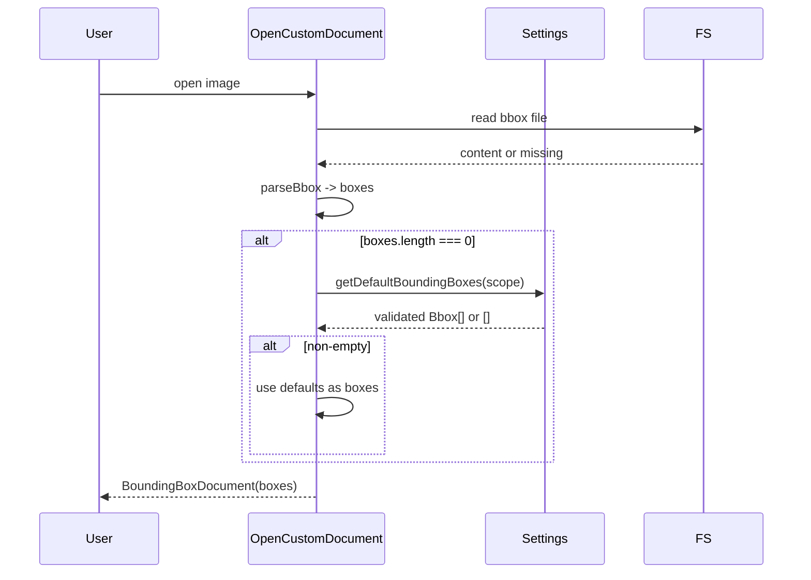

# Default Bounding Boxes Feature

## Current behavior

- **Opening an image** ([src/editorProvider.ts](src/editorProvider.ts)): `openCustomDocument` resolves the bbox file URI, reads it (or leaves `bboxContent` empty if the file is missing), then parses with `parseBbox(bboxContent, format, 0, 0)` to get `boxes`. So "no bounding box" = no bbox file or empty/parseable content yielding zero boxes.
- **Bbox shape** ([src/bbox.ts](src/bbox.ts)): `Bbox` uses `x_min`, `y_min`, `width`, `height` (optional `label`). Your "x,y,w,h" maps to `x_min`, `y_min`, `width`, `height` (COCO-style absolute pixels).
- **Settings** ([src/settings.ts](src/settings.ts)): Configuration lives under `boundingBoxEditor`; `getSettings()` returns `BoundingBoxEditorSettings`. Schema is in [package.json](package.json) under `contributes.configuration.properties`.

## Design

1. **New setting**: `boundingBoxEditor.defaultBoundingBoxes` — array of objects `{ x, y, w, h }` with optional `label`. Stored in workspace/user settings; same scope rules as existing settings.
2. **When to apply**: In `openCustomDocument`, after computing `boxes` from the bbox file (which may be empty). If `boxes.length === 0`, resolve default boxes from settings; if the resolved list is non-empty, use it as the initial `boxes` for the document. Do not write the bbox file on open; the file is created when the user saves (existing behavior).
3. **Validation**: Treat the list as invalid if it is not a non-empty array of objects where each entry has `x`, `y`, `w`, `h` as finite numbers and `w > 0`, `h > 0`. Invalid or empty → do not add any box (return/use empty array).

## Implementation

### 1. Configuration schema ([package.json](package.json))

- Add a new property under `boundingBoxEditor`:
  - Key: `defaultBoundingBoxes`
  - Type: `array` of `object` with properties `x`, `y`, `w`, `h` (numbers), optional `label` (string)
  - Default: `[]`
  - Description: e.g. "Default bounding boxes (x, y, w, h) applied when opening an image that has no bounding box file or empty boxes. Empty or invalid list means no boxes are added."

### 2. Settings and validation ([src/settings.ts](src/settings.ts))

- **Option A**: Add `defaultBoundingBoxes: Bbox[]` (or a dedicated type like `DefaultBboxEntry[]`) to `BoundingBoxEditorSettings` and in `getSettings()` read the raw array, validate, and map to `Bbox[]` (only include valid entries; if any invalid or list empty, use `[]`). Then editor just uses `settings.defaultBoundingBoxes`.
- **Option B**: Keep settings type as-is and add a separate exported function `getDefaultBoundingBoxes(scope?: vscode.ConfigurationScope): Bbox[]` that reads the raw config, validates, and returns either a non-empty array of `Bbox` or `[]`.

Recommendation: **Option B** — validation lives in one place and returns `Bbox[]`; `openCustomDocument` calls `getDefaultBoundingBoxes(scope)` and uses the result only when current `boxes.length === 0`.

- Validation helper (internal or in same file): input = raw config value (unknown). If not an array or length 0, return `[]`. For each element, check `typeof x,y,w,h === 'number' && Number.isFinite(...) && w > 0 && h > 0`; map to `{ x_min: x, y_min: y, width: w, height: h, label }`. If any element is invalid, treat the whole list as invalid and return `[]` (per "if list is ... invalid then the bounding box is not added"). So: only return a non-empty array when every entry is valid.

### 3. Editor provider ([src/editorProvider.ts](src/editorProvider.ts))

- In `openCustomDocument`, after:
  - `const boxes = parseBbox(bboxContent, settings.bboxFormat, 0, 0);`
- Add:
  - If `boxes.length === 0`, call `getDefaultBoundingBoxes(scope)` (scope can be derived from `uri` via `vscode.workspace.getWorkspaceFolder(uri)` or passed through; use same pattern as existing settings if they use scope).
- If the returned array is non-empty, use it as the initial `boxes` (and keep `bboxContent` as-is so the file is still created on first save with the serialized defaults).

### 4. Tests

- **Settings** ([src/test/settings.test.ts](src/test/settings.test.ts)): Add tests for `getDefaultBoundingBoxes` (or the validation used by it):
  - Empty array or missing config → `[]`
  - Invalid entries (non-array, wrong types, non-finite, w/h <= 0) → `[]`
  - One or more valid entries → correct `Bbox[]` with `x_min`, `y_min`, `width`, `height` (and optional `label`)
- **Editor provider**: If feasible with current test setup, add a test that when bbox file is missing and default boxes are set, the document’s initial `boxes` are the default boxes; otherwise at least keep existing tests passing and add unit tests for the validation logic used by defaults.

## Flow summary

## Edge cases

- **Scope**: Use workspace folder of the opened image (or undefined for user-only) when calling `getDefaultBoundingBoxes` so workspace overrides user defaults when applicable.
- **YOLO**: Default boxes are in absolute pixel coordinates (x, y, w, h). They are stored as `Bbox` in the document; serialization on save already uses `document.imgWidth`/`imgHeight` for YOLO, so no change needed for format.
- **Bbox file exists but empty**: `bboxContent === ''` or parses to 0 boxes → apply defaults; file still not written until user saves.
