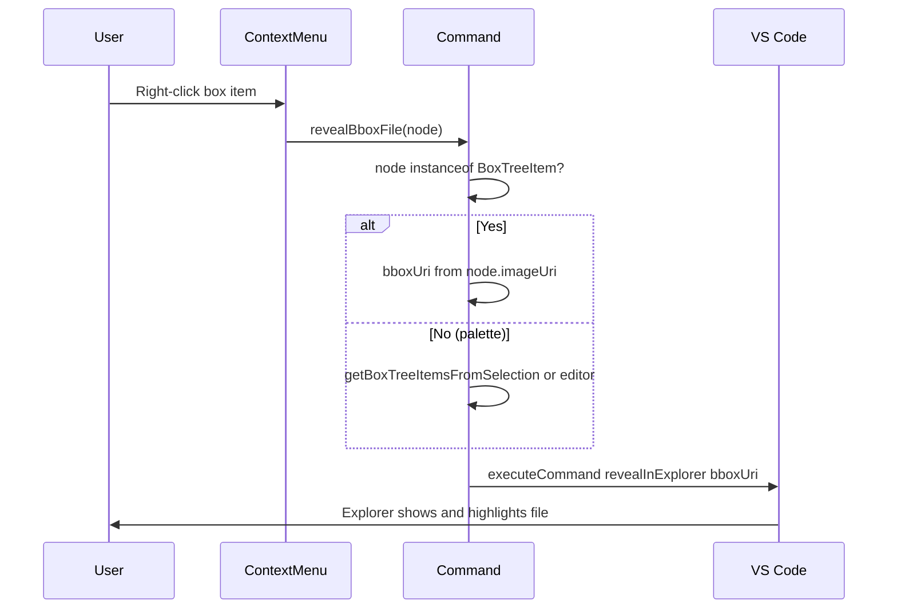

# Fix "Reveal in file explorer" and right-click context menu

## Current state

**Behavior:** The command `bounding-box-editor.revealBboxFile` currently calls `vscode.window.showTextDocument(bboxUri)`, which **opens the bbox file in the editor**. "Reveal in file explorer" is expected to **reveal the file in the Explorer sidebar** (scroll to it, highlight it), not open it as a document.

**Context menu:** The command is already contributed in [package.json](package.json) under `view/item/context` for both `boundingBoxEditor.projectView` and `boundingBoxEditor.bboxSectionView` when `viewItem == bboxItem`. [BoxTreeItem](src/explorer.ts) sets `contextValue = 'bboxItem'`, so the menu *should* appear. If it does not, likely causes are: (1) the command handler does not receive the right-clicked item when invoked from the menu (we only use `getBoxTreeItemsFromSelection()`, which can be wrong if selection is not updated before the menu runs), or (2) a timing/selection issue.

## 1. Fix "Reveal in Explorer" behavior

**File:** [src/extension.ts](src/extension.ts)

- Replace `await vscode.window.showTextDocument(bboxUri)` with revealing the file in the Explorer.
- Use the built-in command: `vscode.commands.executeCommand('revealInExplorer', bboxUri)`. Community usage indicates this accepts a URI and reveals that file in the Explorer sidebar.
- If that command does not accept a URI in your VS Code version, fallback: call `await vscode.window.showTextDocument(bboxUri)` and then `vscode.commands.executeCommand('revealInExplorer')` so the now-active file is revealed.

## 2. Make the right-click context menu reliable

**2a. Pass the tree item from the context menu**

When a command is run from a tree item’s context menu, VS Code passes that tree item as the first argument. Use it so the command does not depend on selection.

**File:** [src/extension.ts](src/extension.ts)

- Change the `revealBboxFile` handler to accept an optional first argument: `(node?: BoxTreeItem | unknown)`.
- If `node instanceof BoxTreeItem`, derive `imageUri` from `node.imageUri` and compute `bboxUri` from it; skip `getBoxTreeItemsFromSelection()` and editor fallback.
- Otherwise (command palette or no node), keep the existing logic: `getBoxTreeItemsFromSelection()` then editor selection fallback for a single box.

**2b. Ensure the menu appears**

- No change needed in [package.json](package.json) for the menu contribution; the existing `view/item/context` entries for `revealBboxFile` with `viewItem == bboxItem` are correct.
- If the menu still does not show after the above, verify in the running extension that:
  - The view IDs are exactly `boundingBoxEditor.projectView` and `boundingBoxEditor.bboxSectionView`.
  - The tree items are `BoxTreeItem` with `contextValue === 'bboxItem'` (already true in [src/explorer.ts](src/explorer.ts) and [src/bboxSection.ts](src/bboxSection.ts) which reuses `BoxTreeItem`).

## 3. Summary of code changes

| Location                             | Change                                                                                                                                |
| ------------------------------------ | ------------------------------------------------------------------------------------------------------------------------------------- |
| [src/extension.ts](src/extension.ts) | Register `revealBboxFile` with `(node?: BoxTreeItem                                                                                   |
| [package.json](package.json)         | No change required for menus; optional: add a test that the command is registered and that BoxTreeItem has `contextValue` `bboxItem`. |

## 4. Tests

- No new test file required. If there is an extension test that runs commands, add a quick check that `revealBboxFile` can be invoked with a `BoxTreeItem` argument and that it does not throw. Coverage remains as-is.

## Flow (after fix)

