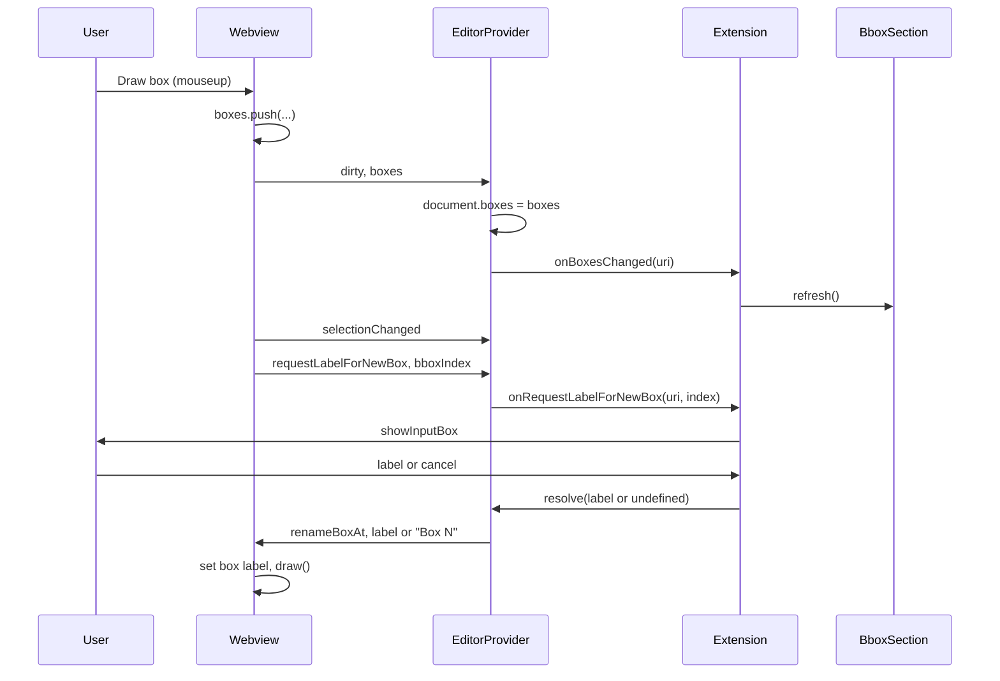

# List update and label palette after drawing a box

## Goals

1. **List updates automatically**: After drawing a new bounding box, the list in the Bounding Boxes panel should show the new box immediately, without requiring Save or switching panels.
2. **Label palette**: After drawing a new box, the extension should open the input palette for the user to type the label. If the user leaves it empty or cancels, default to "Box N" (N = 1-based index in the list).

## Current behavior

- **List**: The Bounding Boxes panel’s [BboxSectionTreeDataProvider](src/bboxSection.ts) always loads boxes via `readMergedBboxContent` (from disk). When the user draws a box, the webview sends `dirty` and `selectionChanged`; the extension calls `bboxSectionProvider.refresh()`, but `getChildren()` still reads from disk, so the new box does not appear until the user saves.
- **Label**: New boxes are pushed without a label; they appear as "Box N" from the tree’s fallback. There is no prompt to enter a label at creation time.

## Implementation plan

### 1. Keep editor document in sync with webview and expose live boxes

**Problem**: The host-side `BoundingBoxDocument` is only updated in `saveCustomDocument` when the user saves. The webview holds the live `boxes` array; the list cannot show unsaved boxes without that data on the host.

**Approach**:

- **Webview** ([src/editorProvider.ts](src/editorProvider.ts) inline script): When sending `dirty`, include the current `boxes` array so the host can keep its document in sync. Change every `vscode.postMessage({ type: 'dirty' })` to `vscode.postMessage({ type: 'dirty', boxes: boxes })` (all places that post `dirty`: draw mouseup, addBox, removeBoxAt, removeBoxAtIndices, renameBoxAt, dblclick, keydown delete).
- **Editor provider** ([src/editorProvider.ts](src/editorProvider.ts)):
  - Keep a map of open documents: `_documentsByUri = new Map<string, BoundingBoxDocument>()`. In `resolveCustomEditor`, store the document: `this._documentsByUri.set(document.uri.toString(), document)`. In `webviewPanel.onDidDispose`, remove it: `this._documentsByUri.delete(document.uri.toString())`.
  - In the `dirty` handler: if `msg.boxes` is an array, set `document.boxes = msg.boxes` so the host document stays in sync with the webview. Then fire `_onDidChangeCustomDocument` as today.
  - Add a public method `getBoxesForImage(imageUri: vscode.Uri): Bbox[] | undefined` that returns `this._documentsByUri.get(imageUri.toString())?.boxes` (so the extension can read live boxes when the editor is open).

### 2. Bounding Boxes panel uses live boxes when editor is open

**File**: [src/bboxSection.ts](src/bboxSection.ts)

- Add an optional constructor option: `getLiveBoxes?: (imageUri: vscode.Uri) => Bbox[] | undefined`.
- In `getChildren(undefined)`: after resolving `imageUri` (from `getSelectedImageUri()`), if `this._getLiveBoxes` is defined, call `this._getLiveBoxes(imageUri)`. If the result is a non-undefined array (length can be 0), use that as the source of `boxes` for building the tree items; otherwise keep the current behavior and load from disk via `readMergedBboxContent`. This way, when the image is open in the custom editor, the list shows the in-memory boxes (including the newly drawn one); when the editor is closed, the list falls back to disk.

**File**: [src/extension.ts](src/extension.ts)

- When constructing `BboxSectionTreeDataProvider`, pass `getLiveBoxes: (uri) => editorProvider.getBoxesForImage(uri)` (the editor provider is created later; ensure `editorProvider` is in scope when creating the tree provider, or pass the getter after construction—currently `bboxSectionProvider` is created before `editorProvider`, so we need to either pass the getter later or create the bbox section provider after the editor provider and pass `getLiveBoxes` then). Easiest: create `bboxSectionProvider` with an options object that can be set or use a closure: we create the editor provider and then need to pass `getLiveBoxes` into the bbox section. So we have two options: (1) Create bbox section provider after editor provider and pass `getLiveBoxes: (uri) => editorProvider.getBoxesForImage(uri)`. That would require reordering in `extension.ts`: create editorProvider first (we need it for getBoxesForImage), but editorProvider is created with callbacks that reference bboxSectionProvider. So we have a circular dependency: editorProvider needs bboxSectionProvider for onBboxSaved, onSelectionChanged, etc.; bboxSectionProvider needs editorProvider for getLiveBoxes. So we must either: (A) Pass getLiveBoxes as a setter that the extension calls after both are created, e.g. `bboxSectionProvider.setGetLiveBoxes(fn)`, or (B) Create editorProvider with a lazy getter for getLiveBoxes that closes over a variable that we set after creating editorProvider. Option (B): `let getLiveBoxes: (uri: vscode.Uri) => Bbox[] | undefined = () => undefined;` then create bboxSectionProvider with `getLiveBoxes: (uri) => getLiveBoxes(uri)`. Then create editorProvider; then `getLiveBoxes = (uri) => editorProvider.getBoxesForImage(uri);`. That works.
- Implement that in the plan.

### 3. Label palette after drawing or adding a box

**Webview** ([src/editorProvider.ts](src/editorProvider.ts) inline script):

- After the user finishes drawing a new box (in the mouseup handler where we `boxes.push(...)` and `notifySelectionChanged()`), send a new message: `vscode.postMessage({ type: 'requestLabelForNewBox', bboxIndex: boxes.length - 1 })`.
- After handling the `addBox` message (sidebar “Create new bounding box”), also send: `vscode.postMessage({ type: 'requestLabelForNewBox', bboxIndex: boxes.length - 1 })` so the same label flow runs when a box is added from the sidebar.

**Editor provider** ([src/editorProvider.ts](src/editorProvider.ts)):

- Add an optional option: `onRequestLabelForNewBox?: (imageUri: vscode.Uri, bboxIndex: number) => Promise<string | undefined>`.
- In the webview message handler, handle `msg.type === 'requestLabelForNewBox'` and `typeof msg.bboxIndex === 'number'`: call `this._options.onRequestLabelForNewBox?.(document.uri, msg.bboxIndex)`. When the promise resolves, send to the webview `{ type: 'renameBoxAt', bboxIndex: msg.bboxIndex, label: result ?? \`Box ${msg.bboxIndex + 1} }`(so empty string or undefined becomes "Box N"). Use`.then(...)` so the handler does not need to be async; avoid leaving the promise unhandled.

**Extension** ([src/extension.ts](src/extension.ts)):

- Implement and pass the new callback when creating the editor provider: `onRequestLabelForNewBox: async (imageUri, bboxIndex) => { const value = \`Box ${bboxIndex + 1}; const result = await vscode.window.showInputBox({ title: 'Label for new bounding box', value, prompt: 'Enter a label for the new box (leave empty for default).' }); return result === undefined ? undefined : result.trim(); }`. If the user cancels,` showInputBox`returns`undefined`; we then send default "Box N" from the editor provider. If the user confirms with an empty string, we can treat it as default: e.g. return` undefined`when`result.trim() === ''`so the editor provider uses`Box ${bboxIndex + 1}`.

### 4. Refresh list when boxes change (dirty with boxes)

When the editor provider updates `document.boxes` on receiving `dirty` with `boxes`, the Bounding Boxes list should refresh so the new box appears. The extension already calls `bboxSectionProvider.refresh()` from `onSelectionChanged`, and the webview sends `selectionChanged` right after drawing. So when the user draws a box: (1) webview sends `dirty` (with boxes) and `selectionChanged`, (2) editor updates document.boxes and fires document change, (3) extension’s onSelectionChanged runs and calls bboxSectionProvider.refresh(), (4) getChildren runs and getLiveBoxes(uri) returns document.boxes (now including the new box). So the list should update. We only need to ensure the order of message handling doesn’t leave the list stale—e.g. if `selectionChanged` is processed before `dirty`, then refresh would run before document.boxes is updated. So we should either: (a) have the webview send boxes in the same message as selectionChanged, or (b) have the editor provider, when it updates document.boxes on dirty, call a new callback like `onBoxesChanged?.(document.uri)` that the extension uses to call `bboxSectionProvider.refresh()`. Option (b) is cleaner: in the editor provider’s dirty handler, after updating document.boxes, call `this._options.onBoxesChanged?.(document.uri)`. The extension subscribes with `onBoxesChanged: (uri) => { bboxSectionProvider.refresh(); }`. That way, whenever the webview reports new boxes (dirty with boxes), we refresh the list. We still keep onSelectionChanged refreshing for selection highlight; onBoxesChanged ensures the list content (box count/names) updates. So add `onBoxesChanged?: (imageUri: vscode.Uri) => void` to the editor provider options and call it when we set document.boxes from a dirty message; extension implements it by calling `bboxSectionProvider.refresh()`.

### 5. Tests and changelog

- **Tests**: (1) Editor provider: when a message `{ type: 'dirty', boxes: [...] }` is received, `document.boxes` is updated and (if implemented) a callback is invoked. (2) BboxSection: when `getLiveBoxes(imageUri)` returns an array, `getChildren(undefined)` uses that array instead of calling `readMergedBboxContent` (mock getLiveBoxes). (3) Optional: extension’s `onRequestLabelForNewBox` shows input and returns value (hard to unit test showInputBox; can be left to manual verification).
- **Changelog**: Under `[Unreleased]` → `### Added`: “After drawing or adding a bounding box, the extension prompts for a label via an input box; empty or cancel uses default ‘Box N’.” Under `### Fixed`: “Bounding Boxes list now updates immediately when drawing a new box, without saving or switching panels.”

## Summary of code changes

| File                                           | Change                                                                                                                                                                                                                                                                                                                                                                                                                                                                                                                                  |
| ---------------------------------------------- | --------------------------------------------------------------------------------------------------------------------------------------------------------------------------------------------------------------------------------------------------------------------------------------------------------------------------------------------------------------------------------------------------------------------------------------------------------------------------------------------------------------------------------------- |
| [src/editorProvider.ts](src/editorProvider.ts) | Add `_documentsByUri`; in `resolveCustomEditor` store document and remove on dispose. In dirty handler, if `msg.boxes` is array set `document.boxes = msg.boxes` and call `onBoxesChanged?.(document.uri)`. Add `getBoxesForImage(uri)`. Add option `onRequestLabelForNewBox` and handle `requestLabelForNewBox` by calling it and then sending `renameBoxAt` with label or default. In webview script: send `boxes` with every `dirty` postMessage; after drawing a box and after addBox, send `requestLabelForNewBox` with bboxIndex. |
| [src/bboxSection.ts](src/bboxSection.ts)       | Add optional `getLiveBoxes?: (imageUri: vscode.Uri) => Bbox[]                                                                                                                                                                                                                                                                                                                                                                                                                                                                           |
| [src/extension.ts](src/extension.ts)           | Pass `getLiveBoxes` into BboxSectionTreeDataProvider (via a lazy getter that closes over `editorProvider` after it’s created). Add `onBoxesChanged: (uri) => bboxSectionProvider.refresh()`. Add `onRequestLabelForNewBox` that shows `vscode.window.showInputBox` and returns trimmed string or undefined.                                                                                                                                                                                                                             |
| [CHANGELOG.md](CHANGELOG.md)                   | Add one `### Added` and one `### Fixed` entry under `[Unreleased]`.                                                                                                                                                                                                                                                                                                                                                                                                                                                                     |

## Flow (after implementation)

