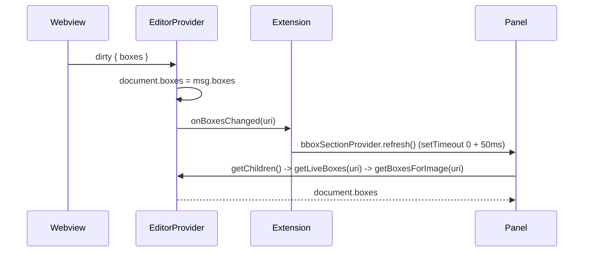

# Panel list update when adding/renaming a bounding box

## Problem

When a new bounding box is created and the user enters its label, the "Bounding Boxes" side panel does not refresh to show the new box (or its label). Expected: data is written to the file and the panel list updates. The user suspects backend cache may be correct but the UI does not refresh.

## Data flow (current)




- Panel list is driven by [BboxSectionTreeDataProvider.getChildren](src/bboxSection.ts): it uses `getLiveBoxes(lookupUri)` which in production is `editorProvider.getBoxesForImage(uri)` ([extension.ts](src/extension.ts) line 172). So the list shows in-memory `document.boxes`.
- [editorProvider.ts](src/editorProvider.ts) (lines 263–279): on `dirty` with `msg.boxes`, the handler already sets `document.boxes = msg.boxes` and calls `onBoxesChanged(document.uri)` **immediately** (then writes to disk and calls `onBboxSaved` in `.then()`). So the backend is correct.
- Webview script ([editorProvider.ts](src/editorProvider.ts) lines 713–719): on `renameBoxAt` it updates the box label and posts `{ type: 'dirty', boxes: boxes }`. So in theory the host receives a second `dirty` with the labeled box and the panel should refresh.

**Why the UI can still be wrong**

1. **No update until webview echoes dirty**
  When the user enters the label, the host only sends `renameBoxAt` to the webview. The host does **not** update `document.boxes` or call `onBoxesChanged` at that moment. So the panel only updates when the webview sends `dirty` back. If that message is delayed, lost (e.g. webview context), or never sent, the panel stays stale.
2. **E2E / unit tests don’t fail when the panel is wrong**
  [bboxEditor.e2e.test.ts](src/test/bboxEditor.e2e.test.ts) uses conditional assertions: `if (boxItems1.length >= 1)` and `if (boxItems2.length >= 2)` (lines 148–150, 176–180, etc.). So the test does not fail when the panel list is empty or missing the new/renamed box. The unit test in [editorProvider.test.ts](src/test/editorProvider.test.ts) (dirty → onBoxesChanged) does not assert that the **panel** would see the new boxes (it only asserts provider state).

## Fix

### 1. Optimistic update when sending `renameBoxAt` (editorProvider)

**File:** [src/editorProvider.ts](src/editorProvider.ts)

In the `requestLabelForNewBox` handler (around 276–281), after resolving the label and before/after posting `renameBoxAt`:

- Update the host’s document so the panel can show the new label without waiting for the webview’s `dirty`:
  - If `document.boxes[bboxIndex]` exists, set `document.boxes[bboxIndex] = { ...document.boxes[bboxIndex], label: resolved }` (or equivalent immutable update).
  - Call `this._options.onBoxesChanged?.(document.uri)` so the Bounding Boxes panel refreshes immediately.

Keep posting `renameBoxAt` so the webview stays in sync. If the webview later sends `dirty`, the handler will overwrite `document.boxes` again (idempotent).

### 2. Keep current dirty handling

No change needed: dirty handler already sets `document.boxes = msg.boxes` and calls `onBoxesChanged(document.uri)` immediately; only `onBboxSaved` stays in the write’s `.then()`.

### 3. Optional: make panel refresh more reliable (extension.ts)

Current `onBoxesChanged` in [extension.ts](src/extension.ts) (lines 117–122) does:

```ts
onBoxesChanged: () => {
  setTimeout(() => {
    bboxSectionProvider.refresh();
    setTimeout(() => bboxSectionProvider.refresh(), 50);
  }, 0);
},
```

If flakiness remains after the optimistic update, consider calling `bboxSectionProvider.refresh()` once synchronously (or with a single `setTimeout(0)`) so the tree re-queries `getChildren` as soon as the host state is updated. The double refresh can stay as a fallback only if needed.

### 4. Unit tests (editorProvider + bboxSection)

**File:** [src/test/editorProvider.test.ts](src/test/editorProvider.test.ts)

- **Existing:** “dirty message with boxes updates document.boxes and calls onBoxesChanged” already asserts that after a simulated `dirty`, `onBoxesChanged` is called and `getBoxesForImage` returns the new boxes. Keep it.
- **New:** Add a test that when the provider resolves a “label for new box” and would send `renameBoxAt`, it **also** updates the document’s box at that index with the resolved label and calls `onBoxesChanged`. Assert:
  - `getBoxesForImage(doc.uri)` returns boxes where the box at the given index has the new label.
  - `onBoxesChanged` was called with `doc.uri`.

This can be done by opening a document, resolving the custom editor with a mock webview that captures the message listener, then triggering the requestLabelForNewBox path (e.g. by having the mock emit a message that leads to the same code path, or by calling the handler that runs when `requestLabelForNewBox` is received) with a stub `onRequestLabelForNewBox` that returns a fixed label, and asserting document state and `onBoxesChanged` after the promise resolves.

**File:** [src/test/bboxSection.test.ts](src/test/bboxSection.test.ts) (if useful)

- Optionally add a test that when `getLiveBoxes` returns an array with a given label, `getChildren(undefined)` returns box items with that label (with selected image URI and resolveImageUri set up so the provider uses that getLiveBoxes). This ties the “panel list shows what getLiveBoxes returns” contract to a test.

### 5. E2E tests: strict panel assertions

**File:** [src/test/bboxEditor.e2e.test.ts](src/test/bboxEditor.e2e.test.ts)

Replace conditional panel checks with **strict** assertions so the test fails if the panel list is wrong:

- After adding the first box and renaming it (e.g. “First Box”): assert `boxItems1.length === 1` and `boxItems1[0].label === 'First Box'` (no `if (boxItems1.length >= 1)`).
- After adding the second box and renaming it: assert `boxItems2.length === 2` and both labels.
- After deletion: assert `boxItems3.length === 1` and the remaining label.
- After the third box (default label): assert `boxItems4.length === 2` and both labels.

If the E2E environment sometimes does not run the webview or messages are delayed, add a short retry/wait (e.g. small delay or poll `getChildren()` until the expected count and labels appear, with a timeout) so the test is stable but still fails if the panel never updates. Prefer making the test strict first; add retries only if necessary to avoid flakiness.

### 6. Changelog

Per [.cursor/rules/changelog.mdc](.cursor/rules/changelog.mdc): under `## [Unreleased]` → `### Fixed`, add: “Bounding Boxes panel list now updates when adding or renaming a bounding box (including when the user enters the label), and tests assert panel list content.”

## Summary


| Item                                                               | Action                                                                                                                                                                                                          |
| ------------------------------------------------------------------ | --------------------------------------------------------------------------------------------------------------------------------------------------------------------------------------------------------------- |
| [src/editorProvider.ts](src/editorProvider.ts)                     | In the `requestLabelForNewBox` callback, after resolving the label: update `document.boxes[bboxIndex].label` (or replace the box) and call `onBoxesChanged(document.uri)` before or when posting `renameBoxAt`. |
| [src/test/editorProvider.test.ts](src/test/editorProvider.test.ts) | Add unit test: after “label for new box” path with a resolved label, document has the label at that index and `onBoxesChanged` was called.                                                                      |
| [src/test/bboxEditor.e2e.test.ts](src/test/bboxEditor.e2e.test.ts) | Replace conditional panel assertions with strict ones (exact length and labels); add minimal delay/retry only if needed for stability.                                                                          |
| [CHANGELOG.md](CHANGELOG.md)                                       | Add Unreleased / Fixed entry for panel update and tests.                                                                                                                                                        |


