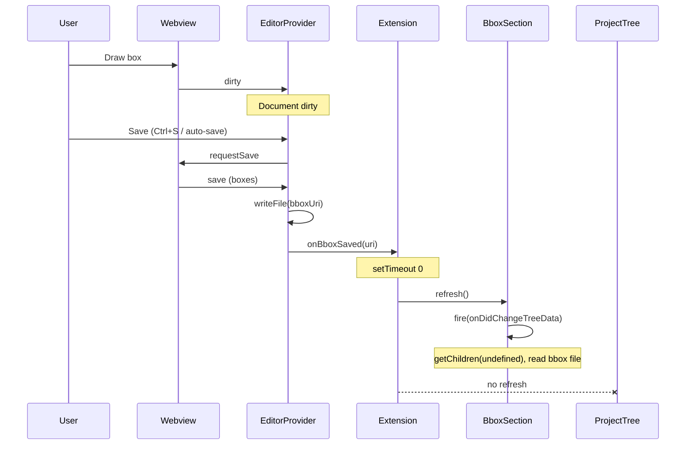

# Panel refresh and editable new box

## Problem summary

1. **Slowness**: After the user draws a box on the image, the extension is slow to add it to the list in the Bounding Boxes panel. The user suspects (and the code confirms) that the extension is doing more work than needed—e.g. re-reading all files in the folder or refreshing the whole project tree.
2. **New box not editable**: The newly added "Box N" in the Bounding Boxes panel is not editable (Rename / context menu) until the user refreshes the window or switches away from the extension panel and back.

## Current behavior

**Save flow**

- User draws a box → webview posts `dirty` (and `selectionChanged`). The document is marked dirty.
- When the document is saved (Ctrl+S or auto-save), [src/editorProvider.ts](src/editorProvider.ts) runs `saveCustomDocument`: writes the bbox file, then calls `onBboxSaved(document.uri)`.
- In [src/extension.ts](src/extension.ts), `onBboxSaved` is wired to `refreshTrees()` (line 71), which does:
  - `projectProvider.refresh()` → tree re-calls `getChildren(undefined)` for the **Project** view, which runs `findFiles` over the image directory and, for **each image**, `getBboxCandidateUris` (readDirectory) and then for expanded nodes `readMergedBboxContent` (read all candidate bbox files). This is heavy and unnecessary when only one image’s bbox file changed.
  - `bboxSectionProvider.refresh()` → tree re-calls `getChildren(undefined)` for the **Bounding Boxes** view, which runs `getBboxCandidateUris` (one readDirectory) and `readMergedBboxContent` (read bbox file(s) for the selected image only). This is the minimum needed to show the new box.

So the main source of slowness is refreshing the **entire Project tree** on every bbox save. The Bounding Boxes section only needs to re-read the bbox file(s) for the current image, which is acceptable.

**Editability**

- After save, `_onDidChangeTreeData.fire()` is called for the Bounding Boxes provider, so VS Code re-calls `getChildren(undefined)` and gets new `BoxTreeItem` instances including the new box. The new item can still fail to respond to Rename/context menu until the user refocuses the view. This is consistent with the tree view not fully re-binding or re-rendering the new row when the refresh happens in the same tick as the file write.

## Implementation plan

### 1. On bbox save: refresh only the Bounding Boxes section (no Project tree)

**File**: [src/extension.ts](src/extension.ts)

- Change `onBboxSaved` so it does **not** call full `refreshTrees()`. Call only `bboxSectionProvider.refresh()` when a bbox file is saved.
- Keep `refreshTrees()` for:
  - User-triggered "Refresh" command (`bounding-box-editor.refreshView`).
  - Other operations that truly affect the whole workspace (e.g. "Delete All" boxes, remove selected boxes from disk, rename box, create-new-box flow if it creates a new file).

**Result**: After drawing a box and save, only the Bounding Boxes panel is refreshed; it will still call `getBboxCandidateUris` and `readMergedBboxContent` for the selected image (one directory read + one or a few file reads). The Project tree is not refreshed, so no `findFiles` and no per-image bbox reads.

**Edge case**: If the user adds the first box to an image (bbox file is created for the first time), the Project tree will not show the new bbox file until they use "Refresh" or expand that image again. That is acceptable; we can document it or optionally call `projectProvider.refresh()` only when the primary bbox file did not exist before (would require passing more context from the editor, so optional follow-up).

### 2. Make the new "Box N" editable without switching panels

**Approach**: Ensure the Bounding Boxes tree view fully re-renders after save so the new row is properly bound. Two concrete steps:

- **Defer the Bounding Boxes refresh** after save: schedule `bboxSectionProvider.refresh()` with `setTimeout(..., 0)` (or a small delay, e.g. 50 ms) so it runs after the current stack and after the file system has flushed. This can resolve timing issues where the tree re-queries before the file is fully visible or before the view has finished updating.
- **Optional second refresh**: If a single deferred refresh is not enough in practice, add a second `bboxSectionProvider.refresh()` after a short delay (e.g. 50–100 ms) to force the tree to fully re-render; this can help with tree views that do not fully update new rows in one pass.

**File**: [src/extension.ts](src/extension.ts)

- Introduce a dedicated callback for "bbox saved" that:
  1. Calls `bboxSectionProvider.refresh()` once after a microtask/defer (`setTimeout(fn, 0)`).
  2. Optionally, if needed after testing, calls `bboxSectionProvider.refresh()` again after a short delay.

**File**: [src/editorProvider.ts](src/editorProvider.ts)

- No change to the editor; it already calls `onBboxSaved?.(document.uri)` after a successful write.

### 3. Optional: avoid re-reading from disk for the Bounding Boxes panel on save

Currently, after save, the Bounding Boxes panel’s `getChildren(undefined)` runs `readMergedBboxContent`, which re-reads the bbox file(s) from disk. The editor already has the up-to-date `document.boxes` at save time. A possible optimization:

- Extend the save callback to `onBboxSaved?.(document.uri, document.boxes)` (or pass a "box count" / "last index").
- In the extension, allow the Bounding Boxes provider to accept a temporary "cached" list of boxes for the current image (e.g. set on save, cleared on next non-save refresh). When present, `getChildren(undefined)` would use that cache instead of calling `readMergedBboxContent` for that image.

This reduces I/O and can make the list update feel instant. It is optional and slightly more invasive (cache lifecycle, ensuring it’s invalidated when the user switches image or refreshes). The main fix is (1) + (2); this can be a follow-up.

### 4. Tests and changelog

- **Tests**: Add or adjust tests so that:
  - On bbox save, only the Bounding Boxes provider’s refresh is triggered (not the project provider), e.g. in [src/test/extension.test.ts](src/test/extension.test.ts) or a dedicated integration test.
  - No new tests strictly required for the deferred refresh (behavior is timing/UI); manual verification is acceptable.
- **Changelog**: Under `[Unreleased]` in [CHANGELOG.md](CHANGELOG.md):
  - **Fixed**: Bounding Boxes panel was slow to show a newly drawn box because the whole project tree was refreshed on every save; only the Bounding Boxes section is refreshed now.
  - **Fixed**: Newly added "Box N" in the Bounding Boxes panel was not editable (Rename/context menu) until refreshing or switching panels; a deferred refresh after save ensures the new item is fully usable.

## Summary of code changes

| File                                 | Change                                                                                                                                                                                                                                                                 |
| ------------------------------------ | ---------------------------------------------------------------------------------------------------------------------------------------------------------------------------------------------------------------------------------------------------------------------- |
| [src/extension.ts](src/extension.ts) | Wire `onBboxSaved` to a new handler that calls only `bboxSectionProvider.refresh()`, deferred with `setTimeout(..., 0)` (and optionally a second refresh after 50–100 ms if needed). Leave `refreshTrees()` for the Refresh command and other full-refresh operations. |
| [CHANGELOG.md](CHANGELOG.md)         | Add two entries under `### Fixed` in `[Unreleased]`.                                                                                                                                                                                                                   |

## Diagram (save flow after fix)

