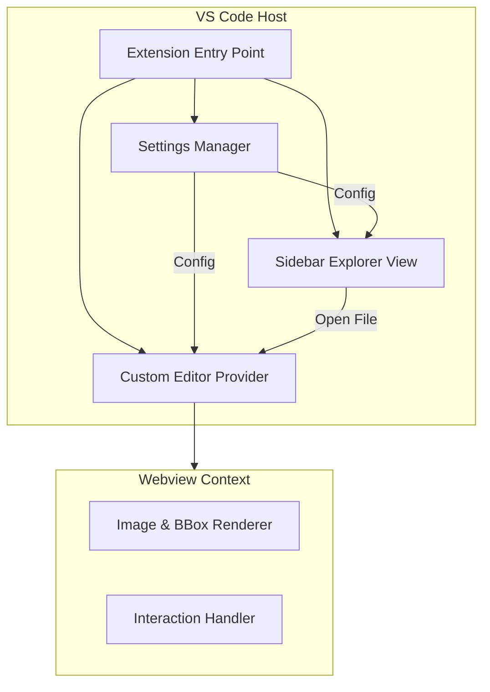

I will set up the foundational structure for the Bounding Box Editor VS Code extension. This involves defining the project's purpose and rules, and planning the implementation of the core features: project configuration, custom editor for images/boxes, and sidebar explorer.

### Phase 1: Documentation & Standards

- **README.md**: Update the existing `README.md` to reflect the extension's purpose, features, and configuration options.
- **.cursor/rules/**: Create `.mdc` rules to enforce:
  - Mandatory unit tests for new features.
  - Coding standards for VS Code extension development.
  - Documentation requirements for library quirks.

### Phase 2: Configuration & Settings

- Update `package.json` to include configuration settings for:
  - `imageDirectory`: Where images are stored (default: current workspace).
  - `bboxDirectory`: Where bounding box files are stored (default: same as image).
  - `bboxFormat`: Format of the bounding box files (default: COCO).
- Implement a settings manager to handle user/workspace level configurations.

### Phase 3: Sidebar Explorer

- Define a new View Container and View in `package.json`.
- Implement a `TreeDataProvider` to list images and their associated bounding box files based on the configured directories.
- Add an icon to the Activity Bar for the extension.

### Phase 4: Custom Editor (The Core)

- Implement a `CustomEditorProvider` to handle `.jpg`, `.png`, and the chosen bounding box format.
- Create a Webview-based editor that:
  - Loads and renders the image.
  - Parses the bounding box file (COCO format by default).
  - Overlays SVG or Canvas-based bounding boxes on the image.
  - Allows interactive editing (drag, resize, add, delete).
  - Syncs changes back to the bounding box text file.

### Phase 5: Testing & Refinement

- Set up a test suite using `@vscode/test-cli`.
- Ensure >80% coverage for core logic (parsing, coordinate conversion).
- Document any workarounds for Webview or VS Code API limitations.

### Mermaid Architecture Diagram

