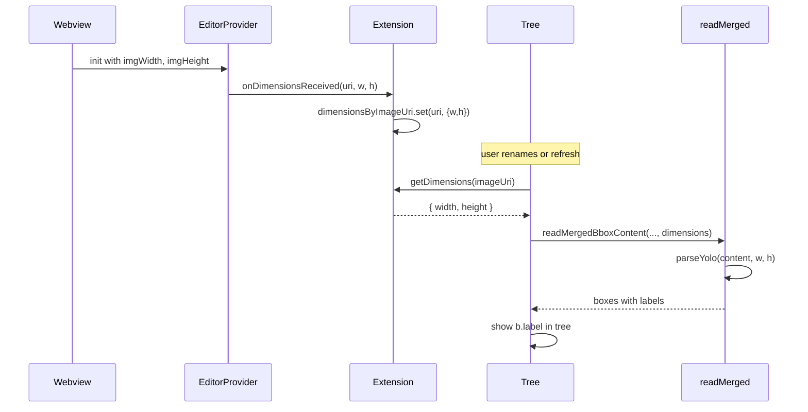

# YOLO label display and rename error handling

## Current behavior

- **YOLO in tree**: [bboxSection.ts](src/bboxSection.ts) and [explorer.ts](src/explorer.ts) use a YOLO-only branch that always shows `"Box ${i + 1}"` and ignore `b.label`.
- **YOLO parsing**: [readMergedBboxContent](src/settings.ts) calls `provider.parse(content, 0, 0)`. For YOLO, [parseYolo](src/bbox.ts) requires `imgWidth > 0 && imgHeight > 0`, so it returns `[]` and the tree shows no boxes for YOLO when refreshing from file.
- **Rename**: [doRenameBox](src/extension.ts) has no try/catch; file read/write and YOLO postMessage paths can throw. The editor’s [save handler](src/editorProvider.ts) (triggered after renameBoxAt) does not catch write errors or show toasts.

## Implementation

### 1. Show YOLO labels in the tree

- **bboxSection.ts** (lines 52–56): For YOLO, build items like the non-YOLO branch: use `b.label !== undefined && b.label !== '' ? b.label : \`Box ${i + 1}`and pass`description`(e.g.`x:... y:... w:... h:...`) so YOLO items match other formats.
- **explorer.ts** (lines 143–151): Same change for the Project tree’s YOLO branch: use `b.label` with fallback and include description.

### 2. Provide dimensions for YOLO so the tree has boxes

- **editorProvider.ts**
  - Extend [BoundingBoxEditorProviderOptions](src/editorProvider.ts): add `onDimensionsReceived?: (imageUri: vscode.Uri, width: number, height: number) => void`.
  - In the `init` message handler (after setting `document.imgWidth` / `document.imgHeight`), call `this._options.onDimensionsReceived?.(document.uri, msg.imgWidth, msg.imgHeight)`.
- **extension.ts**
  - Add a `Map<string, { width: number; height: number }>` (e.g. `dimensionsByImageUri`) and a getter `getDimensions(uri: vscode.Uri)` that returns the stored dimensions or `undefined`.
  - Pass `onDimensionsReceived` when creating the editor provider: store `(imageUri, width, height)` in the map (key `imageUri.toString()`). Optionally clear the entry when the editor is disposed (in `webviewPanel.onDidDispose`) so stale dimensions are not reused.
- **settings.ts**
  - Change [readMergedBboxContent](src/settings.ts) signature to accept an optional 4th parameter: `dimensions?: { width: number; height: number }`.
  - When building `boxes`, if the provider is YOLO and `dimensions` is provided, call `provider.parse(content, dimensions.width, dimensions.height)`; otherwise keep `provider.parse(content, 0, 0)`.
- **bboxSection.ts**
  - Add optional constructor option: `getDimensions?: (uri: vscode.Uri) => { width: number; height: number } | undefined`.
  - In `getChildren`, when calling `readMergedBboxContent(folder, imageUri)`, pass a 4th argument: `getDimensions?.(imageUri)` (only for the selected image).
- **explorer.ts**
  - Add the same optional `getDimensions` to the constructor of [ProjectTreeDataProvider](src/explorer.ts).
  - In `getChildren` for the BoundingBoxesGroupItem branch, call `readMergedBboxContent(..., getDimensions?.(element.imageUri))`.

Wire `getDimensions` from the extension into both tree providers when instantiating them.

### 3. Rename: toast on error

- **extension.ts** – [doRenameBox](src/extension.ts):
  - Wrap the whole function body in try/catch (or per-phase catches).
  - On failure: `void vscode.window.showErrorMessage(\`Failed to rename bounding box: . ${err.message})` (use a short cause string, e.g. “Could not read bbox file”, “Could not write bbox file”, “Invalid box index”, “Editor not open for YOLO”, etc., depending on where it failed).
  - Ensure no silent returns for error cases: either show the toast and return, or rethrow after showing.
- **editorProvider.ts** – save handler (after renameBoxAt the webview sends `save`):
  - Wrap the save block (serialize + writeFile + update document + onBboxSaved) in try/catch.
  - On error: `void vscode.window.showErrorMessage(\`Failed to save bounding boxes: ${err.message})` (or include a cause like “Could not write bbox file”).

### 4. Tests and changelog

- **Tests**: Add or extend unit tests for (1) YOLO label display in tree data (bboxSection and explorer return correct label/description for YOLO when boxes have labels); (2) readMergedBboxContent with optional dimensions (YOLO parse uses dimensions when provided); (3) doRenameBox error path (e.g. showErrorMessage called when read/write fails). Keep coverage above 80%.
- **CHANGELOG.md**: Under `[Unreleased]` / `### Added` or `### Fixed`: mention that YOLO box labels are shown in the Bounding Boxes section and Project tree, and that rename/save failures show an error toast with cause and message.

## Data flow (dimensions for YOLO tree)

## Files to touch

| File                                           | Changes                                                                                                                                               |
| ---------------------------------------------- | ----------------------------------------------------------------------------------------------------------------------------------------------------- |
| [src/bboxSection.ts](src/bboxSection.ts)       | Use `b.label` (+ description) for YOLO; optional `getDimensions` in constructor and in `readMergedBboxContent` call.                                  |
| [src/explorer.ts](src/explorer.ts)             | Same YOLO label/description; optional `getDimensions` and pass to `readMergedBboxContent`.                                                            |
| [src/settings.ts](src/settings.ts)             | `readMergedBboxContent(..., dimensions?)` and use dimensions for YOLO parse.                                                                          |
| [src/editorProvider.ts](src/editorProvider.ts) | `onDimensionsReceived` option + call on init; try/catch in save handler + showErrorMessage.                                                           |
| [src/extension.ts](src/extension.ts)           | dimensions map + getter; pass `onDimensionsReceived` and `getDimensions` to editor and tree providers; try/catch and showErrorMessage in doRenameBox. |
| Tests                                          | bboxSection, explorer, settings, extension (rename error), editorProvider (save error) as needed.                                                     |
| [CHANGELOG.md](CHANGELOG.md)                   | Entry for YOLO labels and error toasts.                                                                                                               |

