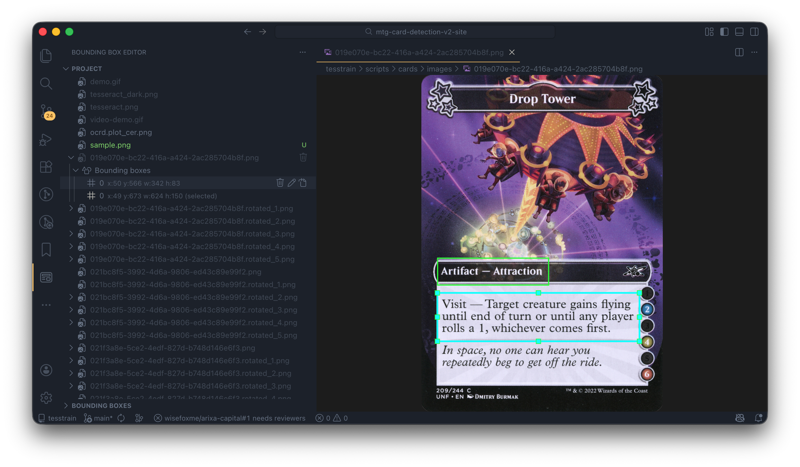

# Bounding Box Editor

A Visual Studio Code extension for viewing and editing bounding box annotations on images. It shows images with overlaid boxes and keeps annotations in text files that you can configure per workspace.

## Features

- **Sidebar view**: Activity Bar icon opens an explorer that lists your project’s images. Expand an image to see "Bounding boxes" and its box items; click a box to open the image with that box selected. The **Bounding Boxes** section shows boxes for the currently selected image; Add boxes by opening an image in the Bounding Box Editor and drawing on the canvas (click and drag).
- **Custom editor**: Opening an image opens a webview with boxes drawn on top. Select a box and drag edges or corners to resize, or drag the body to move. Double-click a box to delete it. Saving creates or updates the bbox file automatically.
- **Configurable paths**: Use VS Code settings (user or workspace) to set where images and bounding box files live; boxes are matched to images by file name.
- **Bounding box format**: Default format is COCO (`x_min y_min width height` in pixels). You can switch to other formats (e.g. YOLO, Pascal VOC) via settings.

## Screenshots

## Requirements

- VS Code `^1.108.1`
- No extra runtime dependencies.

## Extension Settings

Settings are read from the usual VS Code configuration (e.g. `.vscode/settings.json` for the workspace, or user settings). All support **User** and **Workspace** scope.

| Setting | Description | Default |
|--------|-------------|--------|
| `boundingBoxEditor.imageDirectory` | Path (relative to workspace root) where image files are located. | `"."` (workspace root) |
| `boundingBoxEditor.bboxDirectory` | Path (relative to workspace root) where bounding box text files are located. Leave empty or set equal to image directory to keep boxes next to images. | `""` (same as image directory) |
| `boundingBoxEditor.allowedBoundingBoxFileExtensions` | File extensions for bounding box text files that share the image base name. Empty or `"*"` means read all same-base-name files; otherwise only the listed extensions (e.g. `".box"` only reads `*.box`). Saving and commands (reveal, rename, delete, etc.) use a single **primary** file: the first existing candidate or the default path with the first extension (or `.txt` when empty/`"*"`). | `[".txt"]` |
| `boundingBoxEditor.bboxFormat` | Bounding box file format: `"coco"`, `"yolo"`, or `"pascal_voc"`. | `"coco"` |

**Association**: A bounding box file is linked to an image when:
- Its base name (without extension) matches the image file name, and
- It lives in the configured bounding box directory (or image directory if bbox directory is not set).
- Its extension is allowed by `boundingBoxEditor.allowedBoundingBoxFileExtensions` (empty or `"*"` = any extension).

When multiple matching files exist, the extension reads them all and merges their boxes; saving and commands still target a single primary file (first existing or default path).

Example: image `photos/sample.jpg` with default settings will use `photos/sample.txt` (or the path implied by `boundingBoxEditor.bboxDirectory` if set).

### Bounding box formats

- **COCO** (default): One line per object: `x_min y_min width height` (absolute pixels). Optional class/label can be added per line depending on your workflow.
- **YOLO**: Normalized `class x_center y_center width height` (0–1).
- **Pascal VOC**: `x_min y_min x_max y_max` (absolute pixels).

**Tree labels**: In the sidebar tree, COCO and Pascal VOC show parsed labels when available (or "Box 1", "Box 2", …). For YOLO, the tree shows generic "Box 1", "Box 2", … until you open the image in the editor (YOLO needs image dimensions to parse; full labels appear in the editor).

## Known Issues

None at this time. If you hit Webview or VS Code API quirks, workarounds are documented in this README as they are added. Otherwise, please report an issue on the [GitHub repository](https://github.com/wisefoxme/bounding-box-for-vscode/issues).

## Release Notes

See the [CHANGELOG](CHANGELOG.md) for the latest release notes.